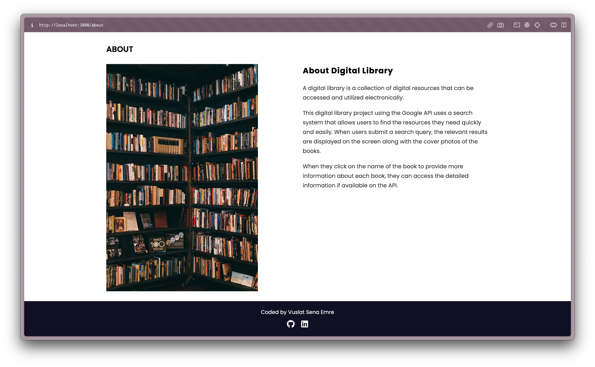
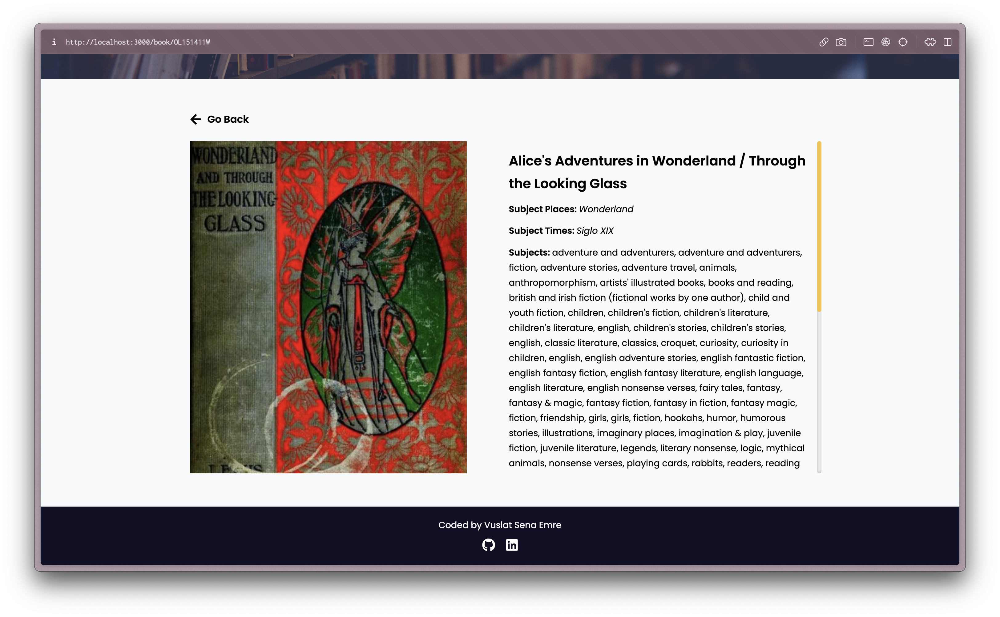

#  Week 4 Homework 6 
Patika.dev &amp; FMSS Bilişim Front-end Practicum Week4 - Homework 6. This is  develop a service that allows users to search for books by title or author by using the Google Books API or any other API.
## Installation
1. Clone the repository
2. `npm install` command to install dependencies
3. `npm start` command to run the application
4. Open `http://localhost:3000` to view the 
application in the browser.

## Assignment Requirements
https://academy.patika.dev/courses/frontend-web-development-projeleri/kitap_arama_uygulamas%C4%B1

## Result

